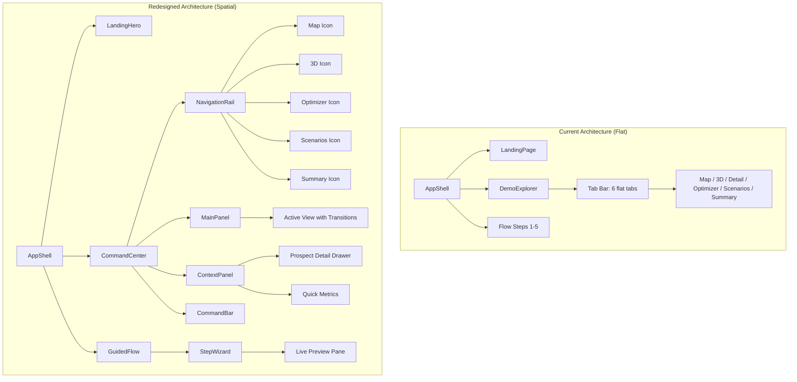
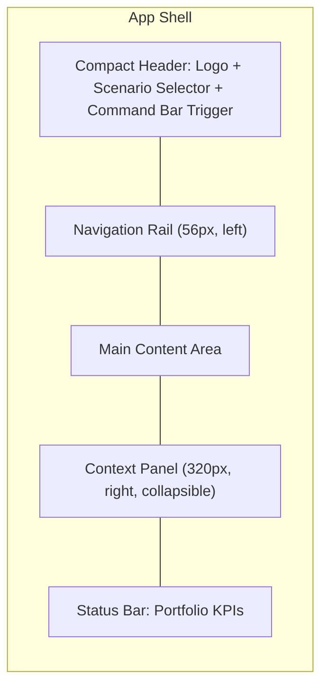
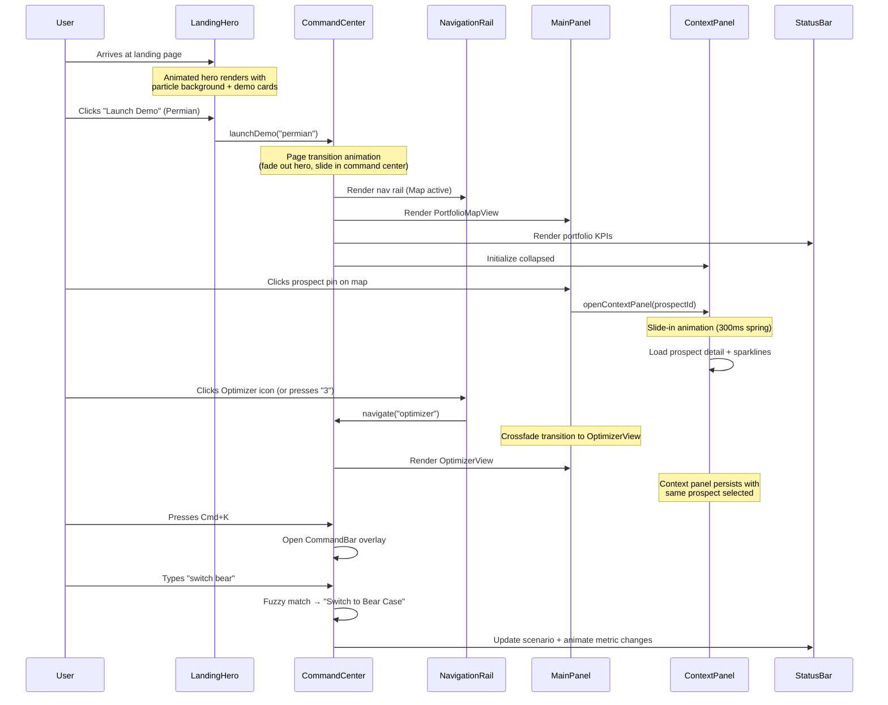
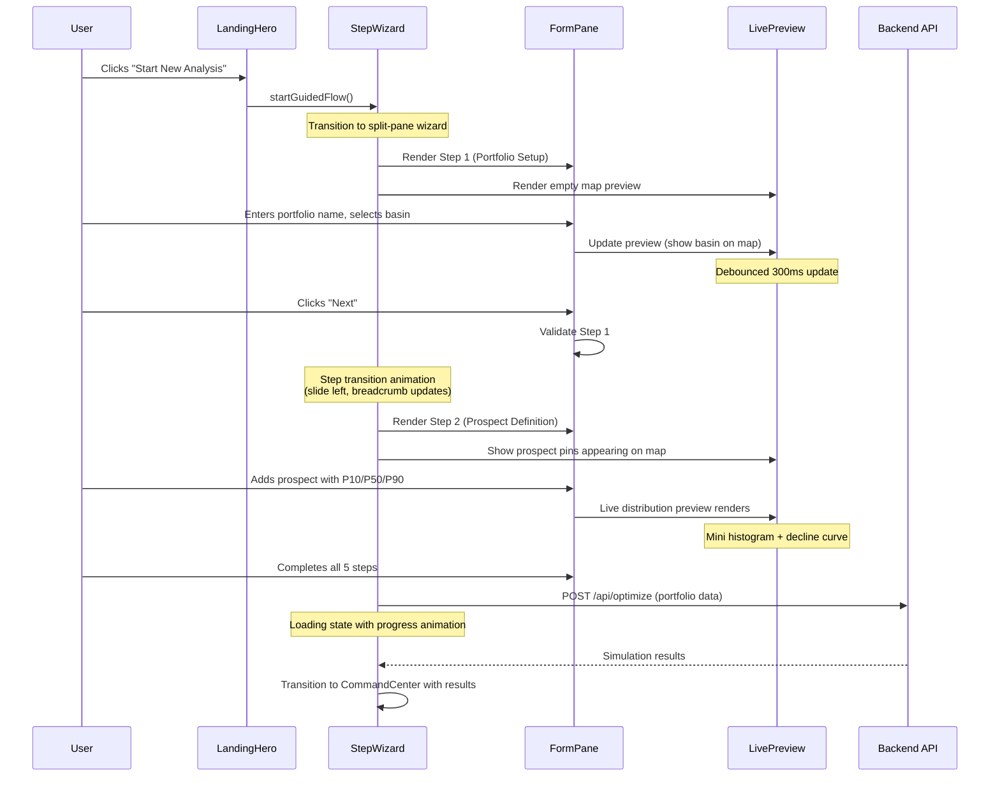

# Design Document: Frontend UX Redesign

## Overview

The current prospect-engine frontend suffers from a flat, utilitarian interface that fails to communicate the sophistication of its underlying Monte Carlo simulation and portfolio optimization engine. The guided input flow consists of placeholder skeleton components with no actual form controls. The demo explorer uses emoji icons for navigation, lacks spatial hierarchy, provides no animated transitions between views, and treats every data point with equal visual weight — making it hard for users to find what matters.

This redesign reimagines the entire frontend experience around three core UX principles: **narrative flow** (the interface tells the story of a portfolio decision), **progressive disclosure** (complexity reveals itself as the user is ready), and **spatial memory** (users always know where they are and how data relates across views). The goal is to create an interface that feels like a Bloomberg terminal designed by Stripe — data-dense but never overwhelming, technically powerful but immediately intuitive.

The redesign preserves the existing React 18 + TypeScript + Tailwind + D3 + Three.js stack and all backend APIs. It restructures the component architecture, introduces a design system, replaces the flat tab navigation with a spatial command-center layout, and transforms the skeleton flow steps into a rich guided experience with live previews.

## Architecture

### Current vs. Redesigned Component Architecture



### Navigation & Layout Model



## Components and Interfaces

### Component 1: Design System Foundation — `DesignTokens`

**Purpose**: Establish a cohesive visual language with semantic color tokens, spacing scale, typography scale, elevation system, and animation curves that replace the current ad-hoc Tailwind classes.

**Interface**:
```typescript
// tailwind.config.ts — Extended Design Tokens
interface DesignTokens {
  colors: {
    // Semantic surface hierarchy (replaces flat bg/panel)
    surface: {
      base: string;       // #06090E — deepest background
      raised: string;     // #0C1219 — card/panel background
      overlay: string;    // #121C28 — modals, drawers, popovers
      interactive: string; // #1A2535 — hover states, active items
      border: {
        subtle: string;   // #1E2A3A — dividers, card borders
        default: string;  // #2A3A4E — input borders
        focus: string;    // #3B82F6 — focus rings
      };
    };
    // Decision palette (preserved, enhanced with gradients)
    decision: {
      drill: { base: string; glow: string; muted: string };    // greens
      farmOut: { base: string; glow: string; muted: string };   // blues
      divest: { base: string; glow: string; muted: string };    // oranges
      defer: { base: string; glow: string; muted: string };     // slate
    };
    // Semantic data colors
    data: {
      positive: string;   // #23D18B — gains, positive NPV
      negative: string;   // #EF4444 — losses, risk
      neutral: string;    // #94A3B8 — baseline
      highlight: string;  // #F59E0B — attention, warnings
      info: string;       // #3B82F6 — informational
    };
    // Text hierarchy
    text: {
      primary: string;    // #F1F5F9
      secondary: string;  // #94A3B8
      tertiary: string;   // #64748B
      inverse: string;    // #0F172A
    };
  };
  spacing: {
    unit: number;  // 4px base unit
    scale: [0, 1, 2, 3, 4, 5, 6, 8, 10, 12, 16, 20, 24];
  };
  typography: {
    display: { size: string; weight: number; tracking: string };
    heading: { size: string; weight: number; tracking: string };
    subheading: { size: string; weight: number; tracking: string };
    body: { size: string; weight: number; lineHeight: string };
    caption: { size: string; weight: number; lineHeight: string };
    mono: { size: string; weight: number; fontFamily: string };
  };
  elevation: {
    low: string;     // subtle shadow for cards
    medium: string;  // drawers, dropdowns
    high: string;    // modals, command bar
  };
  animation: {
    fast: string;      // 150ms — micro-interactions
    normal: string;    // 250ms — panel transitions
    slow: string;      // 400ms — page transitions
    spring: string;    // cubic-bezier(0.34, 1.56, 0.64, 1)
    ease: string;      // cubic-bezier(0.4, 0, 0.2, 1)
  };
  radius: {
    sm: string;   // 6px
    md: string;   // 10px
    lg: string;   // 16px
    full: string; // 9999px
  };
}
```

**Responsibilities**:
- Single source of truth for all visual properties
- Enables consistent dark theme with proper depth hierarchy
- Supports future light theme or high-contrast accessibility mode

### Component 2: `CommandCenter` — Primary Workspace Layout

**Purpose**: Replace the flat DemoExplorer tab layout with a spatial command-center that provides persistent navigation, contextual detail panels, and always-visible portfolio KPIs.

**Interface**:
```typescript
interface CommandCenterProps {
  demoData: DemoData;
  initialView?: ViewId;
  onReturnToLanding: () => void;
}

type ViewId = 'map' | 'subsurface' | 'optimizer' | 'scenarios' | 'summary';

interface CommandCenterState {
  activeView: ViewId;
  contextPanel: {
    open: boolean;
    content: 'prospect-detail' | 'quick-compare' | 'filters' | null;
    prospectId: string | null;
  };
  activeScenario: string;
  commandBarOpen: boolean;
  viewTransition: 'entering' | 'idle' | 'exiting';
}
```

**Responsibilities**:
- Render the navigation rail, main content area, context panel, and status bar
- Manage view transitions with crossfade animations
- Provide keyboard shortcut navigation (1-5 for views, Cmd+K for command bar)
- Persist layout preferences (context panel width, collapsed state)

### Component 3: `NavigationRail` — Vertical Icon Navigation

**Purpose**: Replace the horizontal emoji tab bar with a refined vertical icon rail that provides spatial consistency and supports keyboard navigation.

**Interface**:
```typescript
interface NavigationRailProps {
  activeView: ViewId;
  onNavigate: (view: ViewId) => void;
  prospectCount: number;
  hasAlerts: boolean;  // e.g., fragile prospects detected
}

interface NavItem {
  id: ViewId;
  label: string;
  icon: React.ComponentType<{ className?: string }>;
  shortcut: string;  // e.g., "1", "2"
  badge?: number | 'dot';
}
```

**Responsibilities**:
- Render SVG icons (not emojis) with active state indicators
- Show keyboard shortcut hints on hover
- Display notification badges (e.g., fragile prospect count on scenarios)
- Animate active indicator sliding between items
- Collapse to icons-only on smaller screens

### Component 4: `ContextPanel` — Sliding Detail Drawer

**Purpose**: Provide a persistent, collapsible right-side panel that shows contextual detail for the selected prospect, replacing the current inline overlays and separate detail tab.

**Interface**:
```typescript
interface ContextPanelProps {
  open: boolean;
  onToggle: () => void;
  prospectId: string | null;
  demoData: DemoData;
  activeScenario: string;
  onNavigateToProspect: (id: string) => void;
}
```

**Responsibilities**:
- Slide in/out with spring animation
- Show prospect mini-charts (NPV histogram sparkline, cash flow sparkline)
- Display decision comparison at a glance
- Allow quick navigation between prospects via up/down arrows
- Resize handle for user-adjustable width

### Component 5: `CommandBar` — Quick Action Overlay

**Purpose**: Provide a Spotlight/Cmd+K style command palette for power users to quickly navigate, search prospects, switch scenarios, and trigger exports.

**Interface**:
```typescript
interface CommandBarProps {
  open: boolean;
  onClose: () => void;
  demoData: DemoData;
  onAction: (action: CommandAction) => void;
}

type CommandAction =
  | { type: 'navigate'; view: ViewId }
  | { type: 'select-prospect'; prospectId: string }
  | { type: 'switch-scenario'; scenario: string }
  | { type: 'export'; format: 'csv' | 'pdf' }
  | { type: 'toggle-panel'; panel: 'context' | 'filters' };

interface CommandItem {
  id: string;
  label: string;
  category: 'Navigation' | 'Prospects' | 'Scenarios' | 'Actions';
  icon: React.ComponentType;
  shortcut?: string;
  action: CommandAction;
}
```

**Responsibilities**:
- Fuzzy search across all prospects, views, scenarios, and actions
- Keyboard-navigable results list with category grouping
- Recent actions history
- Animated entrance/exit with backdrop blur

### Component 6: `StatusBar` — Persistent Portfolio KPIs

**Purpose**: Replace the current inline summary bar with a persistent bottom status bar that shows live portfolio metrics, providing constant context regardless of which view is active.

**Interface**:
```typescript
interface StatusBarProps {
  portfolioNPV: number;
  capitalDeployed: number;
  capitalRemaining: number;
  prospectCount: number;
  activeScenario: string;
  riskLevel: 'low' | 'moderate' | 'high';
  onScenarioChange: (scenario: string) => void;
}
```

**Responsibilities**:
- Always visible at bottom of command center
- Animate metric changes with count-up transitions
- Color-code risk level indicator
- Compact responsive layout

### Component 7: `LandingHero` — Redesigned Landing Page

**Purpose**: Transform the current basic landing page into an immersive hero experience that immediately communicates the power of the tool and draws users into exploration.

**Interface**:
```typescript
interface LandingHeroProps {
  onStartAnalysis: () => void;
  onLaunchDemo: (id: 'permian' | 'gom') => void;
}
```

**Responsibilities**:
- Animated hero with subtle particle/grid background suggesting data flow
- Interactive demo cards with hover preview showing a live mini-chart
- Smooth scroll-triggered animations for feature highlights
- Clear value proposition hierarchy: headline → subtext → CTAs → demos
- Keyboard accessible with proper focus management

### Component 8: `StepWizard` — Redesigned Guided Input Flow

**Purpose**: Replace the skeleton step components with a rich split-pane wizard that shows a live preview of the portfolio as the user builds it.

**Interface**:
```typescript
interface StepWizardProps {
  onComplete: (portfolio: PortfolioState) => void;
  onCancel: () => void;
}

interface StepConfig {
  id: string;
  title: string;
  subtitle: string;
  icon: React.ComponentType;
  validate: (state: PortfolioState) => ValidationResult;
}

interface ValidationResult {
  valid: boolean;
  errors: { field: string; message: string }[];
  warnings: { field: string; message: string }[];
}
```

**Responsibilities**:
- Split-pane layout: form controls left, live preview right
- Animated step transitions with progress breadcrumb
- Real-time validation with inline error/warning indicators
- Live preview updates as user adjusts parameters (debounced)
- Step completion indicators with checkmarks
- Ability to jump to any completed step

</text>
</invoke>

### Component 9: `ProspectCard` — Rich Prospect Display

**Purpose**: Replace the plain text list items with rich, information-dense cards that show decision state, key metrics, and mini-visualizations at a glance.

**Interface**:
```typescript
interface ProspectCardProps {
  prospect: DemoProspect;
  result: ProspectResult;
  decision: DecisionType;
  selected: boolean;
  compact?: boolean;
  onClick: (id: string) => void;
}
```

**Responsibilities**:
- Decision color accent bar on left edge
- Inline NPV sparkline (tiny histogram)
- Probability badge with color coding
- Hover state with elevation change and glow
- Selected state with ring highlight
- Compact mode for list views, expanded mode for grid views

### Component 10: `AnimatedMetricCard` — KPI Display with Motion

**Purpose**: Replace the empty MetricCard placeholder with an animated metric display that counts up on mount and pulses on value changes.

**Interface**:
```typescript
interface AnimatedMetricCardProps {
  label: string;
  value: number;
  format: 'currency' | 'percentage' | 'number';
  trend?: { direction: 'up' | 'down' | 'flat'; magnitude: number };
  icon?: React.ComponentType;
  accentColor?: string;
  size?: 'sm' | 'md' | 'lg';
}
```

**Responsibilities**:
- Animated count-up on initial render
- Smooth value transition on updates
- Optional trend indicator with arrow and delta
- Semantic color coding based on positive/negative values
- Responsive sizing


## Data Models

### Model 1: ViewTransition State

```typescript
interface ViewTransitionState {
  from: ViewId | null;
  to: ViewId;
  phase: 'idle' | 'exit' | 'enter';
  direction: 'forward' | 'backward';  // based on nav rail order
}
```

**Validation Rules**:
- `from` is null only on initial render
- `phase` transitions: idle → exit → enter → idle
- `direction` determined by comparing index positions in nav rail

### Model 2: UserPreferences (persisted to localStorage)

```typescript
interface UserPreferences {
  contextPanelWidth: number;       // 280-480px
  contextPanelOpen: boolean;
  preferredScenario: string | null;
  recentCommands: string[];        // last 10 command bar actions
  viewOrder: ViewId[];             // custom nav rail ordering
  compactMode: boolean;            // dense data display
  animationsReduced: boolean;      // respects prefers-reduced-motion
}
```

**Validation Rules**:
- `contextPanelWidth` clamped to [280, 480]
- `recentCommands` max length 10, FIFO
- `animationsReduced` defaults to `window.matchMedia('(prefers-reduced-motion: reduce)').matches`

### Model 3: Enhanced PortfolioState

```typescript
interface EnhancedPortfolioState extends PortfolioState {
  // Wizard progress tracking
  completedSteps: Set<number>;
  currentStep: number;
  stepValidation: Record<number, ValidationResult>;
  
  // Live preview state
  previewDirty: boolean;
  lastPreviewUpdate: number;
}
```

**Validation Rules**:
- `currentStep` must be in range [0, 4]
- Cannot advance past a step with `valid: false` in `stepValidation`
- `previewDirty` set to true on any state change, cleared after preview renders


## Sequence Diagrams

### User Journey: Landing → Demo Exploration



### User Journey: Guided Input Flow




## Algorithmic Pseudocode

### View Transition Algorithm

```typescript
// Manages crossfade transitions between views in the CommandCenter
function transitionToView(
  currentView: ViewId,
  nextView: ViewId,
  setTransition: (state: ViewTransitionState) => void,
  setActiveView: (view: ViewId) => void,
  prefersReducedMotion: boolean
): void {
  const viewOrder: ViewId[] = ['map', 'subsurface', 'optimizer', 'scenarios', 'summary'];
  const fromIndex = viewOrder.indexOf(currentView);
  const toIndex = viewOrder.indexOf(nextView);
  const direction = toIndex > fromIndex ? 'forward' : 'backward';

  if (prefersReducedMotion) {
    // Instant switch — no animation
    setActiveView(nextView);
    setTransition({ from: null, to: nextView, phase: 'idle', direction });
    return;
  }

  // Phase 1: Exit current view
  setTransition({ from: currentView, to: nextView, phase: 'exit', direction });

  // After exit animation completes (150ms)
  setTimeout(() => {
    setActiveView(nextView);
    // Phase 2: Enter new view
    setTransition({ from: currentView, to: nextView, phase: 'enter', direction });

    // Phase 3: Settle to idle
    setTimeout(() => {
      setTransition({ from: null, to: nextView, phase: 'idle', direction });
    }, 200);
  }, 150);
}
```

**Preconditions:**
- `currentView` and `nextView` are valid ViewId values
- `currentView !== nextView`
- Transition state is currently 'idle' (no concurrent transitions)

**Postconditions:**
- `activeView` is set to `nextView`
- Transition state returns to 'idle'
- If `prefersReducedMotion`, transition is instantaneous

### Command Bar Fuzzy Search Algorithm

```typescript
// Fuzzy search across all command items with category-aware ranking
function searchCommands(
  query: string,
  items: CommandItem[],
  recentActions: string[]
): CommandItem[] {
  if (query.length === 0) {
    // Show recent actions first, then top items per category
    const recent = recentActions
      .map(id => items.find(item => item.id === id))
      .filter((item): item is CommandItem => item !== undefined)
      .slice(0, 5);
    
    const remaining = items
      .filter(item => !recentActions.includes(item.id))
      .slice(0, 10);
    
    return [...recent, ...remaining];
  }

  const normalizedQuery = query.toLowerCase().trim();
  
  // Score each item
  const scored = items.map(item => {
    const label = item.label.toLowerCase();
    const category = item.category.toLowerCase();
    
    let score = 0;
    
    // Exact prefix match (highest priority)
    if (label.startsWith(normalizedQuery)) {
      score += 100;
    }
    // Word boundary match
    else if (label.split(/\s+/).some(word => word.startsWith(normalizedQuery))) {
      score += 75;
    }
    // Substring match
    else if (label.includes(normalizedQuery)) {
      score += 50;
    }
    // Category match
    else if (category.includes(normalizedQuery)) {
      score += 25;
    }
    // Fuzzy: all query chars appear in order
    else {
      let qi = 0;
      for (let i = 0; i < label.length && qi < normalizedQuery.length; i++) {
        if (label[i] === normalizedQuery[qi]) qi++;
      }
      if (qi === normalizedQuery.length) score += 10;
    }

    // Boost recent items
    const recencyIndex = recentActions.indexOf(item.id);
    if (recencyIndex !== -1) {
      score += 5 * (recentActions.length - recencyIndex);
    }

    return { item, score };
  });

  return scored
    .filter(s => s.score > 0)
    .sort((a, b) => b.score - a.score)
    .slice(0, 15)
    .map(s => s.item);
}
```

**Preconditions:**
- `items` is a non-empty array of valid CommandItem objects
- `query` is a string (may be empty)
- `recentActions` contains valid item IDs

**Postconditions:**
- Returns at most 15 items
- Items are sorted by relevance score descending
- If query is empty, recent actions appear first
- All returned items have a positive relevance score


### Step Validation Algorithm

```typescript
// Validates a wizard step and determines if the user can proceed
function validateStep(
  stepIndex: number,
  state: EnhancedPortfolioState
): ValidationResult {
  const errors: { field: string; message: string }[] = [];
  const warnings: { field: string; message: string }[] = [];

  switch (stepIndex) {
    case 0: // Portfolio Setup
      if (!state.prospects.length) {
        errors.push({ field: 'prospects', message: 'Add at least one prospect' });
      }
      if (state.budget <= 0) {
        errors.push({ field: 'budget', message: 'Budget must be positive' });
      }
      break;

    case 1: // Prospect Definition
      for (const p of state.prospects) {
        if (!p.name.trim()) {
          errors.push({ field: `prospect.${p.prospect_id}.name`, message: 'Prospect name required' });
        }
        if (p.latitude < -90 || p.latitude > 90) {
          errors.push({ field: `prospect.${p.prospect_id}.lat`, message: 'Invalid latitude' });
        }
        if (p.longitude < -180 || p.longitude > 180) {
          errors.push({ field: `prospect.${p.prospect_id}.lon`, message: 'Invalid longitude' });
        }
      }
      if (state.prospects.length === 1) {
        warnings.push({ field: 'prospects', message: 'Portfolio optimization works best with 3+ prospects' });
      }
      break;

    case 2: // Commodity Pricing
      if (state.selectedScenarios.length === 0) {
        errors.push({ field: 'scenarios', message: 'Select at least one price scenario' });
      }
      break;

    case 3: // Budget & Constraints
      if (state.discountRate < 0 || state.discountRate > 1) {
        errors.push({ field: 'discountRate', message: 'Discount rate must be between 0% and 100%' });
      }
      break;

    case 4: // Run & Explore — no validation needed, just confirmation
      break;
  }

  return { valid: errors.length === 0, errors, warnings };
}
```

**Preconditions:**
- `stepIndex` is in range [0, 4]
- `state` is a valid EnhancedPortfolioState object

**Postconditions:**
- Returns `valid: true` if and only if `errors` array is empty
- `warnings` may be non-empty even when `valid` is true
- Each error/warning references a specific field path

### Animated Count-Up Algorithm

```typescript
// Animates a number from startValue to endValue over duration
function useAnimatedValue(
  targetValue: number,
  duration: number = 600,
  prefersReducedMotion: boolean = false
): number {
  // If reduced motion, return target immediately
  if (prefersReducedMotion) return targetValue;

  // Use easeOutExpo for natural deceleration
  // f(t) = 1 - 2^(-10t) for t in [0, 1]
  const easeOutExpo = (t: number): number => {
    return t === 1 ? 1 : 1 - Math.pow(2, -10 * t);
  };

  // On each animation frame:
  // elapsed = currentTime - startTime
  // progress = clamp(elapsed / duration, 0, 1)
  // easedProgress = easeOutExpo(progress)
  // displayValue = startValue + (endValue - startValue) * easedProgress

  // When targetValue changes:
  // startValue = current displayValue (for smooth transitions)
  // startTime = now
  // Restart animation loop

  return targetValue; // simplified — actual hook uses requestAnimationFrame
}
```

**Preconditions:**
- `targetValue` is a finite number
- `duration` is positive

**Postconditions:**
- Returns a number that smoothly transitions from previous value to `targetValue`
- Animation completes within `duration` milliseconds
- If `prefersReducedMotion`, returns `targetValue` immediately with no animation


## Key Functions with Formal Specifications

### Function 1: `useCommandCenter()`

```typescript
function useCommandCenter(demoData: DemoData): CommandCenterHook
```

**Preconditions:**
- `demoData` is a fully loaded DemoData object with valid input, results, and scene3d
- Component is mounted within React tree

**Postconditions:**
- Returns stable references (memoized callbacks)
- `activeView` is always a valid ViewId
- `contextPanel.prospectId` is null or a valid prospect ID from demoData
- Keyboard listeners are registered on mount and cleaned up on unmount

**Loop Invariants:** N/A

### Function 2: `useViewTransition()`

```typescript
function useViewTransition(): {
  transition: ViewTransitionState;
  navigate: (to: ViewId) => void;
  isTransitioning: boolean;
}
```

**Preconditions:**
- Called within a CommandCenter context provider

**Postconditions:**
- `navigate()` is a no-op if `isTransitioning` is true (prevents concurrent transitions)
- `transition.phase` always returns to 'idle' after a complete transition cycle
- Respects `prefers-reduced-motion` media query

**Loop Invariants:**
- Transition state machine: idle → exit → enter → idle (never skips a phase unless reduced motion)

### Function 3: `useKeyboardShortcuts()`

```typescript
function useKeyboardShortcuts(
  shortcuts: Record<string, () => void>,
  enabled: boolean
): void
```

**Preconditions:**
- `shortcuts` keys are valid keyboard event key identifiers
- `enabled` controls whether listeners are active

**Postconditions:**
- Shortcuts are not triggered when focus is inside an input, textarea, or contenteditable element
- Event listeners are cleaned up when `enabled` becomes false or component unmounts
- Does not prevent default browser shortcuts (Cmd+C, Cmd+V, etc.)

### Function 4: `useUserPreferences()`

```typescript
function useUserPreferences(): {
  preferences: UserPreferences;
  updatePreference: <K extends keyof UserPreferences>(key: K, value: UserPreferences[K]) => void;
  resetPreferences: () => void;
}
```

**Preconditions:**
- localStorage is available

**Postconditions:**
- Preferences are persisted to localStorage on every update
- `animationsReduced` syncs with system `prefers-reduced-motion` on mount
- `contextPanelWidth` is always clamped to [280, 480]
- Invalid stored values are replaced with defaults

## Example Usage

```typescript
// Example 1: CommandCenter with navigation
function App() {
  const { state, launchDemo, returnToLanding } = useDemoMode();

  if (state.mode === 'landing') {
    return <LandingHero onStartAnalysis={startGuidedFlow} onLaunchDemo={launchDemo} />;
  }

  if (state.mode === 'demo') {
    return (
      <CommandCenter
        demoData={state.data}
        initialView="map"
        onReturnToLanding={returnToLanding}
      />
    );
  }

  return <StepWizard onComplete={handleComplete} onCancel={returnToLanding} />;
}

// Example 2: Using the command bar
function CommandCenterInner({ demoData }: { demoData: DemoData }) {
  const { activeView, navigate, commandBarOpen, toggleCommandBar } = useCommandCenter(demoData);

  useKeyboardShortcuts({
    'k': () => toggleCommandBar(),  // Cmd+K handled separately
    '1': () => navigate('map'),
    '2': () => navigate('subsurface'),
    '3': () => navigate('optimizer'),
    '4': () => navigate('scenarios'),
    '5': () => navigate('summary'),
  }, !commandBarOpen);

  return (
    <div className="flex h-screen">
      <NavigationRail activeView={activeView} onNavigate={navigate} />
      <main className="flex-1">
        <ViewRenderer activeView={activeView} demoData={demoData} />
      </main>
      {commandBarOpen && (
        <CommandBar
          open={commandBarOpen}
          onClose={toggleCommandBar}
          demoData={demoData}
          onAction={handleAction}
        />
      )}
    </div>
  );
}

// Example 3: Animated metric with trend
<AnimatedMetricCard
  label="Portfolio NPV"
  value={82_500_000}
  format="currency"
  trend={{ direction: 'up', magnitude: 12.5 }}
  accentColor="var(--color-data-positive)"
  size="lg"
/>

// Example 4: Prospect card in context panel
<ProspectCard
  prospect={selectedProspect}
  result={prospectResult}
  decision="drill"
  selected={true}
  onClick={handleProspectClick}
/>
```


## Correctness Properties

1. **Navigation Consistency**: ∀ view ∈ ViewId, after `navigate(view)` completes, `activeView === view` and the corresponding view component is rendered in the main panel.

2. **Transition State Machine Integrity**: The transition phase always follows the sequence `idle → exit → enter → idle`. No phase is skipped (unless `prefersReducedMotion` is true, in which case the transition is `idle → idle`). At no point can two transitions run concurrently.

3. **Context Panel Prospect Validity**: If `contextPanel.prospectId` is non-null, then `demoData.input.prospects.some(p => p.prospect_id === contextPanel.prospectId)` is true. The context panel never displays data for a non-existent prospect.

4. **Command Bar Search Completeness**: ∀ query string q, if any CommandItem's label contains q as a substring (case-insensitive), that item appears in the search results with a score > 0.

5. **Step Wizard Progression Guard**: The user cannot advance from step N to step N+1 unless `validateStep(N, state).valid === true`. The "Next" button is disabled when validation fails.

6. **Keyboard Shortcut Safety**: Keyboard shortcuts are never triggered when the user's focus is inside an `<input>`, `<textarea>`, or `[contenteditable]` element. This prevents shortcuts from interfering with text entry.

7. **Accessibility Motion Respect**: If `window.matchMedia('(prefers-reduced-motion: reduce)').matches` is true, all animated transitions (view crossfades, count-up metrics, panel slides) are replaced with instant state changes.

8. **User Preferences Persistence**: ∀ preference update via `updatePreference(key, value)`, the value is retrievable after page reload via `localStorage`. Invalid stored values are replaced with defaults on read.

9. **Metric Animation Convergence**: For any `useAnimatedValue(target, duration)` call, the displayed value equals `target` (within floating-point epsilon) after `duration` milliseconds have elapsed.

10. **Responsive Layout Integrity**: The navigation rail collapses to icon-only mode at viewport widths < 768px. The context panel auto-closes at viewport widths < 1024px. The status bar remains visible at all viewport sizes.

## Error Handling

### Error Scenario 1: Demo Data Load Failure

**Condition**: Static demo JSON imports fail (corrupted data, missing fields)
**Response**: Show a graceful error boundary with "Unable to load demo data" message and a retry button
**Recovery**: User clicks retry to re-attempt import; fallback to landing page if retry fails

### Error Scenario 2: Invalid Prospect Selection

**Condition**: User navigates to a prospect ID that doesn't exist in the current dataset (e.g., stale URL parameter)
**Response**: Context panel shows "Prospect not found" with a list of available prospects
**Recovery**: Auto-select the first available prospect after 3 seconds, or let user pick manually

### Error Scenario 3: View Transition Interruption

**Condition**: User rapidly clicks multiple nav items during an active transition
**Response**: Queue the latest navigation request, discard intermediate ones
**Recovery**: Complete current transition, then immediately start transition to the most recently requested view

### Error Scenario 4: LocalStorage Unavailable

**Condition**: localStorage is blocked (private browsing, storage quota exceeded)
**Response**: Fall back to in-memory preferences with no persistence
**Recovery**: Preferences work normally for the session but reset on page reload

### Error Scenario 5: API Failure During Guided Flow

**Condition**: Backend API returns error during simulation run in Step 5
**Response**: Show inline error with specific message, keep form state intact
**Recovery**: User can retry the simulation or go back to adjust parameters


## Testing Strategy

### Unit Testing Approach

Test each new component and hook in isolation using Vitest + React Testing Library:

- `useViewTransition`: Verify state machine transitions, concurrent transition prevention, reduced motion bypass
- `useCommandCenter`: Verify navigation state management, context panel toggling, scenario switching
- `useKeyboardShortcuts`: Verify shortcut registration/cleanup, input element exclusion
- `useUserPreferences`: Verify localStorage read/write, default fallbacks, clamping logic
- `useAnimatedValue`: Verify convergence to target value, reduced motion bypass
- `validateStep`: Verify all validation rules for each step, error/warning generation
- `searchCommands`: Verify fuzzy matching, scoring, category ranking, recent action boosting
- `NavigationRail`: Verify active state rendering, keyboard shortcut hints, badge display
- `AnimatedMetricCard`: Verify correct formatting (currency, percentage, number), trend indicators
- `ProspectCard`: Verify decision color rendering, compact vs expanded modes, click handling

### Property-Based Testing Approach

**Property Test Library**: fast-check

Key properties to test:
- `searchCommands` always returns ≤ 15 results for any input string
- `searchCommands` with empty query always returns items (never empty if items exist)
- `validateStep` returns `valid: true` implies `errors.length === 0`
- `validateStep` returns `valid: false` implies `errors.length > 0`
- `useAnimatedValue` output is always between min(startValue, targetValue) and max(startValue, targetValue)
- View transition state machine never enters an invalid state sequence
- `contextPanelWidth` after `updatePreference` is always in [280, 480]

### Integration Testing Approach

- Full CommandCenter render with mock DemoData: verify navigation between all 5 views
- StepWizard end-to-end: complete all 5 steps with valid data, verify completion callback
- Command bar: open, search, execute action, verify state change
- Context panel: select prospect on map, verify panel opens with correct data
- Responsive behavior: verify layout changes at breakpoints (768px, 1024px, 1280px)

## Performance Considerations

- **View Lazy Loading**: Each view component (Map, 3D, Optimizer, Scenarios, Summary) should be wrapped in `React.lazy()` with `Suspense` boundaries. Only the active view's code is loaded.
- **Transition Optimization**: Use CSS `transform` and `opacity` for all animations (GPU-composited properties). Never animate `width`, `height`, `top`, `left`.
- **Memoization**: All view components wrapped in `React.memo()`. Expensive computations (frontier calculations, decision matrices) wrapped in `useMemo()`.
- **Debounced Preview**: Live preview in StepWizard updates are debounced at 300ms to prevent excessive re-renders during rapid input.
- **Virtual Scrolling**: Prospect lists with >20 items use virtualized rendering to maintain smooth scrolling.
- **Chart Render Budget**: D3 chart updates are batched and throttled to 60fps. SVG elements use `will-change: transform` for smooth interactions.
- **Three.js Scene Management**: 3D scene is initialized once and hidden/shown rather than mounted/unmounted to avoid expensive WebGL context recreation.

## Security Considerations

- **localStorage Sanitization**: All values read from localStorage are validated against expected types before use. Malformed data is discarded and replaced with defaults.
- **Command Bar Input**: Search queries are sanitized before fuzzy matching to prevent ReDoS (catastrophic backtracking in regex). Use simple character-by-character matching instead of regex.
- **Export Functions**: CSV/PDF exports sanitize prospect names and values to prevent formula injection in spreadsheet applications (prefix cells starting with `=`, `+`, `-`, `@` with a single quote).
- **Content Security**: No `dangerouslySetInnerHTML` usage. All dynamic content rendered through React's built-in XSS protection.

## Dependencies

- **Existing (preserved)**: React 18, TypeScript, Vite, Tailwind CSS, D3.js, Three.js, Leaflet
- **New — `framer-motion`**: Production-grade animation library for React. Used for view transitions, panel slides, metric count-ups, and micro-interactions. Chosen over CSS-only animations for its `AnimatePresence` (exit animations), `useReducedMotion()` hook, and spring physics.
- **New — `cmdk`**: Headless command palette component (by Pacocoursey). Provides accessible keyboard navigation, fuzzy search, and composable command groups. ~3KB gzipped. Used for the CommandBar component.
- **New — `@radix-ui/react-tooltip`**: Accessible tooltip primitive for keyboard shortcut hints and data point tooltips. Headless, composable, WAI-ARIA compliant.
- **New — `@tanstack/react-virtual`**: Virtualized list rendering for prospect lists with many items. Lightweight alternative to react-window with better TypeScript support.

