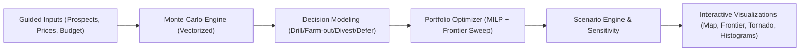

# Architecture

## System Diagram

## Monte Carlo Approach

The backend draws all uncertain variables in batch NumPy arrays and computes economics in vectorized operations. This avoids Python iteration overhead and supports high iteration counts for responsive analysis.

## Portfolio Optimization Methodology

For each risk tolerance `lambda` in `[0,1]`, the optimizer solves a mixed-integer allocation problem with one decision per prospect and budget/constraint compliance. Sweeping `lambda` yields the efficient frontier.

Objective:

`maximize lambda * E[NPV] - (1 - lambda) * StdDev[NPV]`

## Data Flow

1. Input models are validated via Pydantic.
2. Prospect-level simulation returns per-decision distributions and metrics.
3. Decision modeler consolidates option economics for each prospect.
4. Optimizer builds frontier points and selects a risk-adjusted recommendation.
5. Scenario engine repeats pipeline over commodity decks to assess robustness.

## Correlation Handling

Prospect correlations are estimated from common market exposure and simulation covariance. Portfolio risk uses covariance-aware aggregation rather than naive variance summation.

## 3D Subsurface Visualization

The Three.js pipeline renders geological layers, prospect markers, and infrastructure in a 3D scene:

1. Scene data is pre-computed per demo (`demo_3d_scene.json`) with geological layers, prospect positions, and infrastructure coordinates.
2. `SubsurfaceScene.tsx` builds the Three.js scene graph: geological layer meshes, decision-colored prospect pins, infrastructure models, and optional tieback pipelines.
3. Custom `OrbitControls.ts` handles camera rotation, zoom, and pan with smooth damping.
4. Camera presets (overview, cross-section, close-up) are defined per demo and applied via animated transitions.

## Demo Data Pipeline

Pre-computed demos enable the frontend to run without the backend:

1. `backend/scripts/generate_demo_data.py` loads prospect inputs and price scenarios.
2. For each prospect: Monte Carlo simulation, decision comparison, and tornado sensitivity are computed.
3. Portfolio optimization runs across all price scenarios to produce the scenario comparison.
4. Results are serialized to `demo_results.json` alongside `demo_input.json` and `demo_3d_scene.json`.
5. The frontend imports these JSON files statically — no API calls needed for demo mode.

## Smart Defaults Philosophy

Basin defaults provide practical starting values for cost, decline, and productivity while remaining fully editable. Defaults are transparent and designed for quick onboarding.