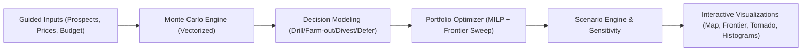

# Architecture

## System Diagram

## Monte Carlo Approach

The backend draws all uncertain variables in batch NumPy arrays and computes economics in vectorized operations. This avoids Python iteration overhead and supports high iteration counts for responsive analysis.

## Portfolio Optimization Methodology

For each risk tolerance `lambda` in `[0,1]`, the optimizer solves a mixed-integer allocation problem with one decision per prospect and budget/constraint compliance. Sweeping `lambda` yields the efficient frontier.

Objective:

`maximize lambda * E[NPV] - (1 - lambda) * StdDev[NPV]`

## Data Flow

1. Input models are validated via Pydantic.
2. Prospect-level simulation returns per-decision distributions and metrics.
3. Decision modeler consolidates option economics for each prospect.
4. Optimizer builds frontier points and selects a risk-adjusted recommendation.
5. Scenario engine repeats pipeline over commodity decks to assess robustness.

## Correlation Handling

Prospect correlations are estimated from common market exposure and simulation covariance. Portfolio risk uses covariance-aware aggregation rather than naive variance summation.

## Smart Defaults Philosophy

Basin defaults provide practical starting values for cost, decline, and productivity while remaining fully editable. Defaults are transparent and designed for quick onboarding.