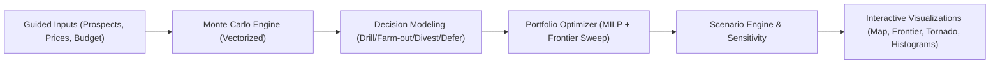

# prospect-engine

Open-source E&P portfolio optimization engine. Monte Carlo simulation meets capital allocation — interactive exploration portfolio decisions for everyone, not just $5M consulting engagements.


## The Problem

E&P capital allocation is often done through expensive consulting studies and brittle spreadsheet workflows that are hard to audit, hard to explain, and slow to iterate. Teams end up with black-box models, stale assumptions, and no way to stress-test decisions across commodity scenarios.

## The Solution

`prospect-engine` combines:

- **Vectorized Monte Carlo simulation** for prospect-level uncertainty (NumPy arrays, no Python loops)
- **Four-decision modeling** — Drill, Farm-out, Divest, Defer — with realistic economics for each
- **Constrained portfolio optimization** via mixed-integer linear programming with efficient frontier sweep
- **Multi-scenario analysis** across commodity price decks to assess decision robustness
- **Interactive visualization** — spatial command-center UI with 2D maps, D3 charts, and Three.js 3D subsurface scenes

## Quick Start

### Docker (recommended)

```bash
docker compose up --build
```

- Frontend: [http://localhost:5173](http://localhost:5173)
- Backend API docs: [http://localhost:8000/docs](http://localhost:8000/docs)

### Local Development

**Backend** (Python 3.11+):

```bash
cd backend
pip install -e ".[dev]"
uvicorn app.main:app --reload --port 8000
```

**Frontend** (Node 20+):

```bash
cd frontend
npm install
npm run dev
```

### Environment Variables

| Variable | Default | Description |
|----------|---------|-------------|
| `VITE_API_URL` | `http://localhost:8000/api` | Backend API base URL (set automatically in Docker) |

### Running Tests

```bash
# Backend
cd backend && pytest

# Frontend
cd frontend && npm test
```

## Demo Walkthrough

The app ships with two pre-computed demo portfolios that run entirely in the browser — no backend required.

### Permian Basin Growth Portfolio

15 onshore prospects, $150M budget.

1. Launch the app and select **Permian Basin** from the landing hero.
2. The **Command Center** opens with a spatial layout — navigation rail on the left, main content area, and a collapsible context panel.
3. Explore the **Portfolio Map** — colored pins with decision-colored accents (Drill, Farm-out, Divest, Defer).
4. Click any prospect to open the **Context Panel** with NPV histogram, cash flow sparklines, and decision details.
5. Use the **Navigation Rail** (or keyboard shortcuts 1-5) to switch between Map, Subsurface, Optimizer, Scenarios, and Summary views.
6. Press **⌘K / Ctrl+K** to open the **Command Bar** for fuzzy search across prospects, views, and actions.
7. The **Status Bar** at the bottom shows live portfolio metrics — NPV, capital deployed, risk level.

### Gulf of Mexico Deepwater

8 offshore prospects, $600M budget, with subsea tiebacks and platform infrastructure in the 3D subsurface view.

### Keyboard Shortcuts

| Shortcut | Action |
|----------|--------|
| `1`–`5` | Switch between views |
| `⌘K` / `Ctrl+K` | Open command bar |
| `↑` / `↓` | Navigate prospects in context panel |
| `Esc` | Close command bar or context panel |

## Architecture



### How the Optimization Works

For each risk tolerance `lambda` in `[0, 1]`, the optimizer solves a mixed-integer allocation problem with one decision per prospect and budget/constraint compliance. Sweeping `lambda` yields the efficient frontier.

**Objective:** `maximize lambda * E[NPV] - (1 - lambda) * StdDev[NPV]`

### Data Flow

1. Input models are validated via Pydantic.
2. Prospect-level simulation returns per-decision distributions and metrics.
3. Decision modeler consolidates option economics for each prospect.
4. Optimizer builds frontier points and selects a risk-adjusted recommendation.
5. Scenario engine repeats the pipeline over commodity decks to assess robustness.

For the full design, see [ARCHITECTURE.md](./ARCHITECTURE.md).

## Project Structure

```
prospect-engine/
├── backend/
│   ├── app/
│   │   ├── main.py                  # FastAPI app entry point
│   │   ├── api/routes.py            # /health, /optimize endpoints
│   │   └── engine/
│   │       ├── monte_carlo.py       # Vectorized Monte Carlo simulation
│   │       ├── decline_curves.py    # Production decline modeling
│   │       ├── decision_modeler.py  # Drill/Farm-out/Divest/Defer economics
│   │       ├── portfolio_optimizer.py  # MILP optimization + frontier sweep
│   │       ├── price_models.py      # Commodity price scenario handling
│   │       ├── prospect_economics.py   # NPV and risk calculations
│   │       ├── scenario_engine.py   # Multi-scenario analysis
│   │       ├── sensitivity.py       # Tornado sensitivity analysis
│   │       ├── models.py            # Pydantic input/output models
│   │       └── defaults.py          # Basin benchmarks & smart defaults
│   ├── data/                        # Basin benchmarks, infrastructure, price decks
│   ├── scripts/generate_demo_data.py  # Pre-compute demo portfolios
│   └── tests/                       # pytest suite (6 test modules)
├── frontend/
│   ├── src/
│   │   ├── components/
│   │   │   ├── charts/              # D3 visualizations (histogram, frontier, tornado)
│   │   │   ├── three/               # Three.js 3D subsurface scene + orbit controls
│   │   │   ├── views/               # Full-page views (map, optimizer, detail, summary)
│   │   │   ├── layout/              # CommandCenter, NavigationRail, ContextPanel, StatusBar, CommandBar, LandingHero
│   │   │   ├── flow/                # StepWizard guided input workflow
│   │   │   ├── shared/              # ProspectCard, AnimatedMetricCard, VirtualizedProspectList, DemoErrorBoundary
│   │   │   └── inputs/              # Form components (CSV upload, distributions)
│   │   ├── data/                    # Pre-computed demo JSON fixtures
│   │   ├── hooks/                   # React hooks (useCommandCenter, useViewTransition, useKeyboardShortcuts, useAnimatedValue, useUserPreferences, useDemoMode)
│   │   ├── lib/                     # Utilities, commandSearch, stepValidation, formatters, CSV export
│   │   ├── types/                   # TypeScript type definitions (command-center, demo, portfolio)
│   │   └── styles/                  # Tailwind CSS, design tokens, globals
│   └── public/                      # Static assets
├── docker-compose.yml
├── ARCHITECTURE.md
├── AUDIT_REPORT.md
└── CHANGELOG.md
```

## Tech Stack

| Layer | Technology |
|-------|-----------|
| **Backend** | FastAPI, Pydantic, NumPy, SciPy |
| **Frontend** | React 18, TypeScript, Vite |
| **Styling** | Tailwind CSS with semantic design tokens |
| **Charts** | D3.js |
| **3D** | Three.js (custom subsurface renderer) |
| **Maps** | Leaflet / react-leaflet |
| **Animations** | Framer Motion |
| **Command Palette** | cmdk |
| **Tooltips** | Radix UI |
| **Virtualization** | TanStack Virtual |
| **Testing** | pytest (backend), Vitest (frontend) |
| **Runtime** | Docker / docker-compose |
| **Python** | 3.11+ |
| **Node** | 20+ |

## API Reference

### `GET /api/health`

Health check. Returns `{"status": "ok"}`.

### `POST /api/optimize`

Run portfolio optimization on a set of prospects.

**Request body:** `PortfolioInput` — prospects with geological parameters, price scenarios, and budget constraints.

**Response:** `PortfolioOptimizationResult` — per-prospect simulation results, decision recommendations, efficient frontier, and scenario comparison.

Full schema available at [http://localhost:8000/docs](http://localhost:8000/docs) when the backend is running.

## Key Concepts

### Decision Framework

Each prospect is evaluated under four mutually exclusive decisions:

| Decision | Description |
|----------|-------------|
| **Drill** | Full capital commitment, full upside/downside exposure |
| **Farm-out** | Reduced working interest, shared risk with partner |
| **Divest** | Sell the prospect; capital-based valuation with transaction costs |
| **Defer** | Hold the prospect; no capital deployed this cycle |

### Smart Defaults

Basin-specific defaults (cost benchmarks, decline parameters, productivity ranges) are loaded from `backend/data/basin_benchmarks.json`. They provide practical starting values while remaining fully editable, designed for fast onboarding without sacrificing accuracy.

### Demo Data Pipeline

Pre-computed demos allow the frontend to run without the backend:

1. `generate_demo_data.py` runs full Monte Carlo + optimization for each demo portfolio.
2. Results are serialized to `demo_input.json`, `demo_results.json`, and `demo_3d_scene.json`.
3. The frontend imports these statically — no API calls needed in demo mode.

## Contributing

1. Fork the repository
2. Create a feature branch
3. Add tests for any engine changes
4. Ensure all tests pass (`pytest` and `npm test`)
5. Submit a pull request

## Roadmap (V2)

- Real-time commodity price feed ingestion
- Type curve library from public well data
- Probabilistic decline curve fitting from production history
- Multi-year capital planning with carry-forward constraints
- Public well database integrations (Enverus/IHS)

## License

Business Source License 1.1 — free for non-production use. Converts to Apache License 2.0 on the change date. See [LICENSE](./LICENSE) for full terms.
